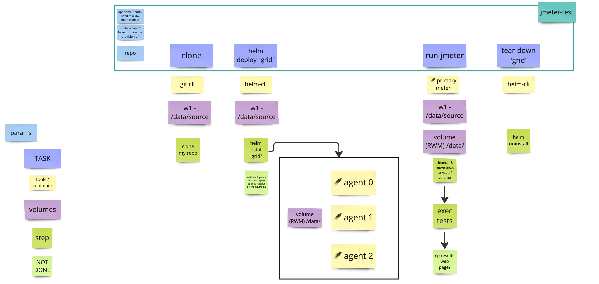

## 🪶 JMeter Grid
> Tekton Pipleine for running JMeter distributed testing on a grid of predermined nodes.



When running, the pipeline will spin up a grid of N agents for running a disrtibuted load test from jmeter on. A sample test etc is found in this monorepo.folder. This project needs `RWM` storage available.  

### 🏃‍♀️ To run ...

1. Login to OCP & create new project for your testing 
```bash
oc login ...
oc new-project minnie-mouse
```

2. Apply the pipleine folder. It has a depndency on the `git-clone` task provided in cluster and adds two new tasks, a workspace and a Pipeline.
```shell
pipeline
├── pipeline
│   └── pipeline.yaml
├── tasks
│   ├── helm-deploy.yaml
│   ├── helm-remove.yaml
│   └── run-jmeter.yaml
└── workspaces
    └── pvc.yaml

oc apply -f pipeline -R
```

3.  Run the pipeline in hte UI or on the terminal. All sensible defaults will spin up a three node grid of agents, run the example test and tear things down after execution
```
tkn pipeline start jmeter-test -w name=source,claimName=jmeter-runs 
```

### 👩‍💻 development
* the chart folder contains the "grid". it uses a shared `RWM` disc to allow data and test cases be copeid to one location for execution. This is packaged as a helm chart
* the `build` folder contains a "borrowed" Containerfile I used to build the image. Credit at top of the file for where it was borrowed...

### What's next?
* add plugins and test data to the image and test further examples
* params on the script (jmeter ones that is)
* triggers on the build

### Playing with Jmeter
with jmeter installed, you can run the example test plan using the following 
```bash
export JMETER_TRASH=/tmp/jmeter
rm -rf ${JMETER_TRASH} && mkdir -p ${JMETER_TRASH}
jmeter -Dlog_level.jmeter=DEBUG -n -t ${PWD}/TestPlans/*.jmx -l ${JMETER_TRASH}/HelloWorld.jtl -j ${JMETER_TRASH}/jmeter.log -Jjmeter.reportgenerator.temp_dir=${JMETER_TRASH} -Jparams.host=en.wikipedia.org -Jparams.num_threads=50 -e -o ${JMETER_TRASH}/report
```

### 🔨 ISSUES
* On cleanup, if the PipelineRun still exists which references a PV created as part of the execution, then it gets stuck in terminating. Remove the P.Run to fix this.
